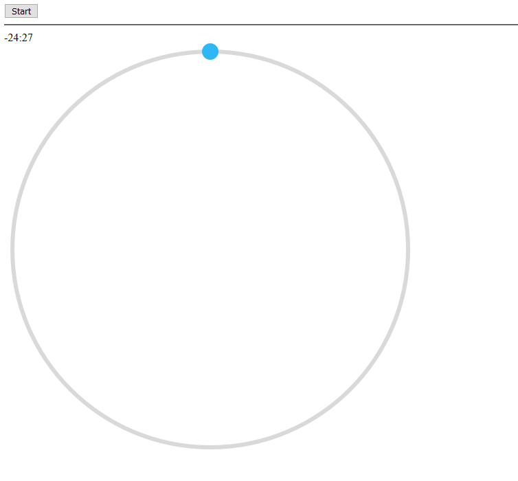

# Mini React Pomodoro

This was an expirement I ran in the summer of 2019 where I had tried livestreaming on Twitch.tv. I wanted to see if there was any potential for programming on that platform. And what I largely discovered was that while there was a market of people looking to watch someone else code, it just isn't exciting enough to hold people's attention. So in order to maintain an audience you have to talk to the people that make their way in, which takes away from the actual development since you are just talking to people.

I established that if you wanted to become popular for programming/coding online that a video format was much more conducive than a streaming platform.

This was just the project that I was working on at the time while talking to the audience. I ended up with about 4-6 viewers max on the first stream and some people returning the next day. So it's possible to grow but at the expense of what you are creating.

Therefore this project is unfinished but it was more of a placeholder project to see if people would come in.


# Running
```js
npm install
npm start
```

Then navigate to `https://localhost:8080`